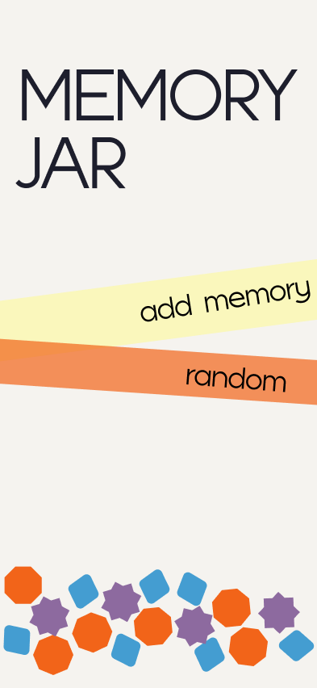
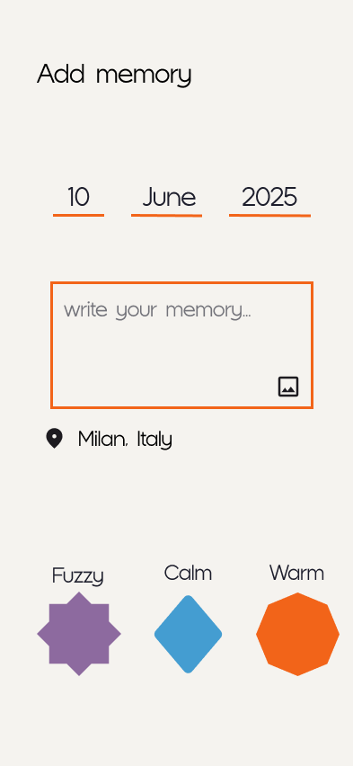

# Memory Jar

<p align="center">
  
</p>

Memory Jar is a small personal journal for saving moments you want to remember. Each memory can include a note, date, location, photo, and a feeling: warm, calm, or fuzzy.

Saved memories become pieces inside an interactive jar. Tap one to read it, open a random memory, or tilt your phone to move the pieces around. Everything is stored locally on the device in SQLite.

The visual style is inspired by Scandinavian minimalism and mid-century European graphic design.

<p align="center">
  
  
  
</p>

The app is built with Expo, React Native, Expo Router, Drizzle ORM, and Matter.js.

## Run it

Install the dependencies and start Expo:

```bash
npm install
npm start
```

Then open it in Expo Go, an Android emulator, an iOS simulator, or a web browser.

Other useful commands:

```bash
npm run android
npm run ios
npm run web
npm run lint
```
